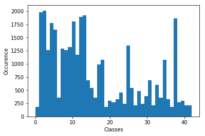
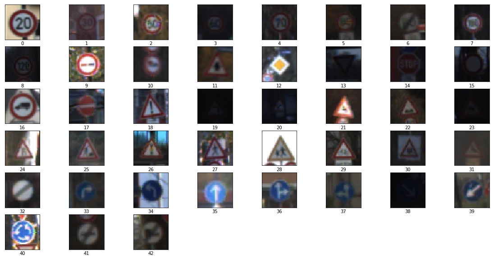
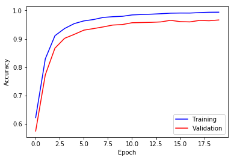
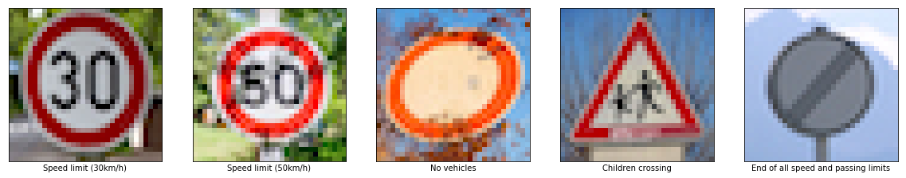

#**Traffic Sign Recognition** 

This is the write up for the Udacity self driving car nanodegree, traffic sign recognition project. The source code for this project is located [here](../code/).
The german traffic sign data used for this project can be downloaded from [here](https://d17h27t6h515a5.cloudfront.net/topher/2017/February/5898cd6f_traffic-signs-data/traffic-signs-data.zip).

##1 - Data Set Summary & Exploration


I used numpy to calculate summary statistics of the traffic signs data set. The data set summary looks as following:

    Number of training examples = 34799
    Number of testing examples = 12630
    Number of validation examples = 4410
    Image data shape = (32, 32, 3)
    Number of classes = 43

The following plot shows how many images are available for each unique class in the training set:




The next diagram shows example images for each class:




##2 - Design and Test a Model Architecture

There are different ways to preprocess images. Important is that the network will be trained on compareable input data. For images this step involves normalization.

### Preprocessing - Normalize images
My implementation of normalization is done per channel using the min/max of the pixel value.


```python
def normalize_images(images):
    for i in range(len(images)):
        images[i][...,0] = (images[i][...,0] - images[i][...,0].mean()) / images[i][...,0].std() - 0.5
        images[i][...,1] = (images[i][...,1] - images[i][...,1].mean()) / images[i][...,1].std() - 0.5
        images[i][...,2] = (images[i][...,2] - images[i][...,2].mean()) / images[i][...,2].std() - 0.5
    return images
    
X_train = X_train.astype(float)
X_valid = X_valid.astype(float)
X_test = X_test.astype(float)

X_train = normalize_images(X_train)
X_valid = normalize_images(X_valid)
X_test = normalize_images(X_test)

from sklearn.utils import shuffle
X_train, y_train = shuffle(X_train, y_train)
```

### Model Architecture
I chose the LeNet-5 architecture as a base for my neural network model. This rather simple architecture shows good performance on image recognition and was tested on the MNIST handwritten digit database with good results.
 
My final model consists of the following layers:

| Layer         		|     Description	        					| 
|:---------------------:|:---------------------------------------------:| 
| Input                   | 32x32x3 RGB image| 
| Convolution 5x5         | 1x1 stride, valid padding, outputs 28x28x6 |
| RELU                    | |
| Max pooling             | 2x2 stride,  outputs 14x14x6 |
| Convolution 5x5         | 1x1 stride, valid padding, outputs 10x10x16 |
| RELU                    | |
| Max pooling             | 2x2 stride,  outputs 5x5x16 |
| Flatten                 | with droput outputs 400 |
| Fully connected         | outputs 120|
| RELU                    |	with dropout |
| Fully connected         | outputs 84 |
| RELU                    |	with dropout |
| Fully connected         | outputs 43 	|
| Softmax	+ cross entropy | |
| L2 regularization       | |

 
## Training the Model

I used the adam optimizer with following parameters for my model:

```python

EPOCHS = 20
BATCH_SIZE = 128

rate = 0.0005 # Learning rate
beta = 0.02   # l2 regularization factor
keep = 0.7    # dropout keep probability
```


As I was increasing the number of epochs for the training, I noticed that the learning accuracy was getting very close to 100% without improving further the validation accuracy. This implies overfitting. To prevent overfitting I added regularization and dropout. This increased the validation results shown below.


    Training...
    
    EPOCH 1 ...
    Training Accuracy = 0.622
    Validation Accuracy = 0.575
    
    EPOCH 2 ...
    Training Accuracy = 0.830
    Validation Accuracy = 0.773
    
    EPOCH 3 ...
    Training Accuracy = 0.911
    Validation Accuracy = 0.867
    
    EPOCH 4 ...
    Training Accuracy = 0.936
    Validation Accuracy = 0.902
    
    EPOCH 5 ...
    Training Accuracy = 0.954
    Validation Accuracy = 0.916
    
    EPOCH 6 ...
    Training Accuracy = 0.963
    Validation Accuracy = 0.931
    
    EPOCH 7 ...
    Training Accuracy = 0.968
    Validation Accuracy = 0.936
    
    EPOCH 8 ...
    Training Accuracy = 0.975
    Validation Accuracy = 0.942
    
    EPOCH 9 ...
    Training Accuracy = 0.978
    Validation Accuracy = 0.949
    
    EPOCH 10 ...
    Training Accuracy = 0.979
    Validation Accuracy = 0.950
    
    EPOCH 11 ...
    Training Accuracy = 0.984
    Validation Accuracy = 0.957
    
    EPOCH 12 ...
    Training Accuracy = 0.986
    Validation Accuracy = 0.957
    
    EPOCH 13 ...
    Training Accuracy = 0.987
    Validation Accuracy = 0.958
    
    EPOCH 14 ...
    Training Accuracy = 0.988
    Validation Accuracy = 0.960
    
    EPOCH 15 ...
    Training Accuracy = 0.990
    Validation Accuracy = 0.965
    
    EPOCH 16 ...
    Training Accuracy = 0.991
    Validation Accuracy = 0.961
    
    EPOCH 17 ...
    Training Accuracy = 0.991
    Validation Accuracy = 0.960
    
    EPOCH 18 ...
    Training Accuracy = 0.992
    Validation Accuracy = 0.965
    
    EPOCH 19 ...
    Training Accuracy = 0.994
    Validation Accuracy = 0.964
    
    EPOCH 20 ...
    Training Accuracy = 0.994
    Validation Accuracy = 0.966
    
    Model saved
    Test Accuracy = 0.943


Below the plot shows the training vs the validation progress on the learning:


```python
plt.plot(training_history, color='b', label='Training')
plt.plot(validation_history, color='r', label='Validation')
plt.xlabel("Epoch")
plt.ylabel("Accuracy")
plt.legend()
plt.show()
```




My final model performed 96.6% accuracy for validation images and 94.3% accuracy for the test images.

---
## Test the Model on New Images


I found the following german traffic sign images on the web. Since the size of the images were varying I had to manually crop and resize the images to 32x32 pixels in size with keeping the RGB color channels.

The following shows the found 5 images with their respective class information:


I applied my model on the new images with following results:

    Top 5 predictions:
    
    Image 1: Speed limit (30km/h)
    -----------------------------
    Top 1 : Prediction =>  "Speed limit (30km/h)" @ 0.99998
    Top 2 : Prediction =>  "Speed limit (50km/h)" @ 0.00001
    Top 3 : Prediction =>  "Speed limit (20km/h)" @ 0.00001
    Top 4 : Prediction =>  "Speed limit (70km/h)" @ 0.00000
    Top 5 : Prediction =>  "End of speed limit (80km/h)" @ 0.00000
    
    Image 2: Speed limit (50km/h)
    -----------------------------

    Top 1 : Prediction =>  "Speed limit (50km/h)" @ 0.96336
    Top 2 : Prediction =>  "Speed limit (80km/h)" @ 0.03539
    Top 3 : Prediction =>  "Speed limit (60km/h)" @ 0.00125
    Top 4 : Prediction =>  "Speed limit (30km/h)" @ 0.00000
    Top 5 : Prediction =>  "Speed limit (100km/h)" @ 0.00000

    Image 3: No vehicles
    -----------------------------    
    Top 1 : Prediction =>  "No vehicles" @ 0.99989
    Top 2 : Prediction =>  "Speed limit (50km/h)" @ 0.00007
    Top 3 : Prediction =>  "Yield" @ 0.00002
    Top 4 : Prediction =>  "Speed limit (30km/h)" @ 0.00001
    Top 5 : Prediction =>  "Speed limit (70km/h)" @ 0.00001
    
    Image 4: Children crossing
    -----------------------------
    Top 1 : Prediction =>  "Children crossing" @ 0.99656
    Top 2 : Prediction =>  "Bicycles crossing" @ 0.00326
    Top 3 : Prediction =>  "Road narrows on the right" @ 0.00016
    Top 4 : Prediction =>  "Dangerous curve to the right" @ 0.00001
    Top 5 : Prediction =>  "Beware of ice/snow" @ 0.00000
    
    Image 5: End of all speed and passing limits
    -----------------------------
    Top 1 : Prediction =>  "End of all speed and passing limits" @ 0.98260
    Top 2 : Prediction =>  "End of speed limit (80km/h)" @ 0.01711
    Top 3 : Prediction =>  "Speed limit (60km/h)" @ 0.00008
    Top 4 : Prediction =>  "End of no passing " @ 0.00007
    Top 5 : Prediction =>  "Speed limit (30km/h)" @ 0.00004


The model was able to correctly guess 5 of the 5 traffic signs which gives an accuracy of 100%. Looking at the softmax probabilities show that the model is very confident most of the time for the first guess with > 0.96.